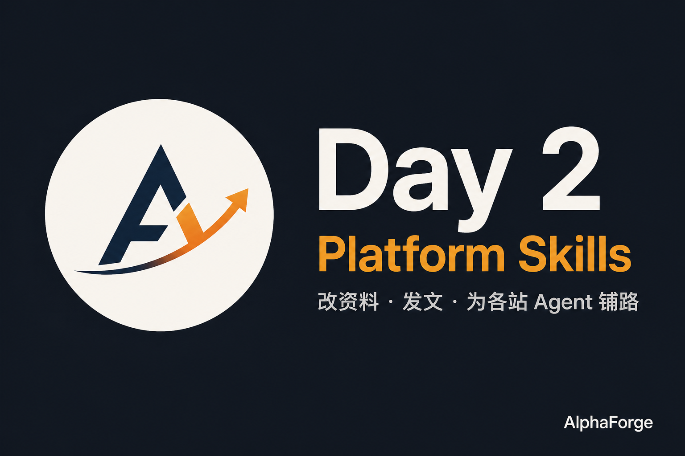

# AlphaForge

> **Forge your investment method into an AI Agent.**
>
> 把你的投资方法，锻造成一个持续工作的 AI Agent。

**Don't let AI invest for you. Let AI execute your investment process with you.**

AlphaForge 是一个 **AI-native Personal Investment Agent Experiment**。

它同时验证两件事：

1. 在 AI Agent 时代，能否把一个投资者自己的投资方法，转化为可执行、可组合、可复盘、可评估、可持续进化的 Investment Skills，并由 Agent 每天持续执行？
2. 一个 Founder + AI Agents，能否从零做出一个真实产品，并把创业过程本身沉淀成 playbook？

---

## 10 秒看懂

| 是 | 不是 |
|---|---|
| 按你自己的投资方法持续执行研究、过滤、Evidence、Thesis、Plan、Review | AI 荐股 / 预测下一只上涨股票 |
| Founder OS + Investment Skills + 公开实验 | 又一个炒股软件 / Dashboard 先行 |

Founder 主页：https://github.com/grlib

---

## 当前阶段 / Current Stage

**公开实验进行中**（Day 002）

目标不是完成一堆 Features，而是产生足够 Evidence，再决定：

`GO / MODIFY / PIVOT / STOP`

方向见 [路线图.md](./路线图.md)。第 N+1 天的任务由第 N 天的 Evidence 决定。

最新公开叙事：[内容/草稿/第002期-GitHub.md](./内容/草稿/第002期-GitHub.md)

---

## Founder OS

| 文档 | 用途 |
|---|---|
| [AGENTS.md](./AGENTS.md) | Agent 工作规则（文件名保留英文约定） |
| [北极星.md](./北极星.md) | 北极星与 14 天成功定义 |
| [第一性原理.md](./第一性原理.md) | 第一性原理 |
| [假设账本.md](./假设账本.md) | 核心假设账本 |
| [产品.md](./产品.md) | 产品定义与边界 |
| [路线图.md](./路线图.md) | 14 天方向，不是功能清单 |
| [决策日志.md](./决策日志.md) | 重大决策日志 |
| [指标.md](./指标.md) | 指标：什么算成功 |
| [增长.md](./增长.md) | 公开构建与增长 |
| [每日循环.md](./每日循环.md) | 每日 Founder Loop |
| [工具链.md](./工具链.md) | 用过的工具 vs 造过的工具 |
| [变更日志.md](./变更日志.md) | 变更记录 |

---

## 每天怎么跑 / Daily Commands

在 Cursor 中：

- `/start-day` — 从昨天的 Evidence 生成今天的 One Goal
- `/end-day` — 复盘、更新账本、写下明天

每天必须产出四类资产：

1. Product Artifact
2. Experiment Evidence
3. Public Content
4. Tomorrow Plan

缺任何一项，不能标记 `DONE`。

---

## 原则 / Principles

- **Intelligence before Interface.** 先 Skill / CLI / Markdown，后 Dashboard。
- **Experiment before Feature.** 无法关联 Hypothesis 的 Feature，默认不建。
- **Asset ≠ Requirement.** 旧系统（CZSC、QMT、Baostock 等）是可复用资产，不是必须迁移的需求。
- **Evidence before Opinion.** 用真实数字，不放大结论。
- **Failure is first-class.** 失败案例不得删除。

---

## Current Issues

14 天只跟踪这 5 个问题：

1. [Prove AlphaForge deserves to exist](https://github.com/grlib/alphaforge/issues/1)
2. [Map the investment decision loop from first principles](https://github.com/grlib/alphaforge/issues/2)
3. [Identify the first high-value Investment Skill](https://github.com/grlib/alphaforge/issues/3)
4. [Build AlphaForge Daily Founder Loop](https://github.com/grlib/alphaforge/issues/4)
5. [Find first 3 external Alpha users](https://github.com/grlib/alphaforge/issues/5)

---

## 如何参与

如果你也有自己的投资方法，却很难持续执行，欢迎：

- Watch / Star [grlib/alphaforge](https://github.com/grlib/alphaforge)，跟着公开实验走
- 在 Issue 里告诉我：你最想让 Agent 替你持续做的一件事是什么
- 成为前 3 个外部 Alpha Users（见 Issue #5）

---

## License

暂缓。当前优先把实验跑起来。见 [决策日志.md](./决策日志.md) D-007。
